## 1. Pengenalan Sistem Basis Data

Pengenalan Database Management System
DBMS adalah aplikasi yang digunakan untuk me-manage data
Tanpa menggunakan DBMS, untuk me-manage data, seperti data produk, data customer, data penjualan, kita harus simpan dalam bentuk file (misal seperti ketika menggunakan Excel)
DBMS biasanya berjalan sebagai aplikasi server yang digunakan untuk me-manage data, kita hanya tinggal memberi perintah ke DBMS untuk melakukan proses manajemen datanya, seperti menambah, mengubah, menghapus atau mengambil data
Contoh DBMS yang populer seperti MySQL, PostgreSQL, MongoDB, Oracle, dan lain-lain

### 1.1. Pengenalan Relational Database
Ada banyak sekali jenis-jenis DBMS, seperti Relational Database, Document Database, Key-Value Database, dan lain-lain
Namun yang masih populer dan kebanyakan orang gunakan adalah relational database
Relational database cukup mudah dimengerti dan dipelajari karena kita sudah terbiasa menyimpan data dalam bentuk tabular (tabel) seperti di Microsoft Excel atau di Google Doc Spreadsheet
Selain itu relational database memiliki perintah standard menggunakan SQL, sehingga kita mudah ketika ingin berganti-ganti aplikasi database (seperti MySQL, Oracle, PostgreSQL dan lain-lain)

### 1.2. Cara Kerja DBMS
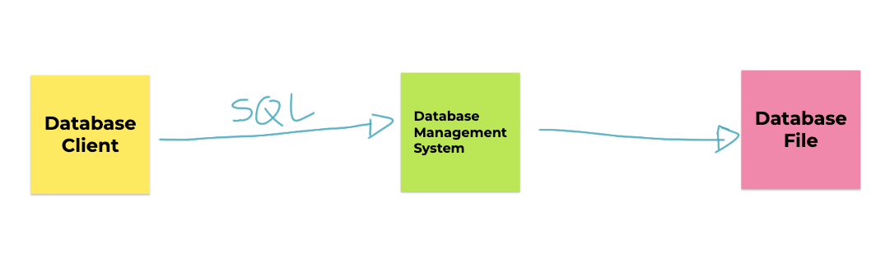

Database Client
Database client adalah aplikasi yang digunakan untuk berkomunikasi dengan DBMS
Biasanya DBMS sudah menyediakan database client sederhana yang bisa kita gunakan untuk berkomunikasi dengan DBMS agar lebih mudah
Atau kita bisa membuat aplikasi untuk berkomunikasi dengan DBMS, misal membuat aplikasi database client menggunakan Java, PHP atau bahasa pemrograman lainnya

### 1.3. Database File
Mayoritas DBMS menyimpan datanya di file, walaupun ada beberapa database yang hanya menyimpan datanya di memory (RAM)
Namun jangan berpikir file database yang disimpan berupa file seperti Excel atau CSV (Comma Separated Value), tapi jauh lebih kompleks
Database File akan di optimasi oleh DBMS agar mempermudah DBMS dalam manajemen datanya, seperti insert, update, delete dan select
Tiap DBMS biasanya memiliki cara masing-masing mengelola Database File nya, dan kita tidak perlu harus tau, karena yang kita perlu tahu hanya cara berkomunikasi ke DBMS

### 1.4. SQL
Structured Query Language
Merupakan bahasa yang digunakan untuk mengirim perintah ke DBMS
SQL adalah bahasa yang mudah karena hanya berisi instruksi untuk menyimpan, mengubah, menghapus atau mengambil data melalui DBMS
Secara garis besar, semua perintah SQL di Relational Database itu hampir sama, namun biasanya tiap DBMS ada improvement yang membedakan hal-hal kecil dalam perintah SQL, namun secara garis besar perintahnya tetap sama

## 2. Pengenalan MySQL

### 2.1. MySQL
MySQL adalah DBMS Relational OpenSource yang paling populer di dunia saat ini
Tidak hanya OpenSource, MySQL juga gratis untuk digunakan
MySQL pertama kali dibuat dan diperkenalkan tahun 1995 oleh David Axmark dan Michael Widenius
MySQL sangat populer sekali terutama dikalangan programmer web PHP
https://www.mysql.com/ 

### 2.2. Kenapa Belajar MySQL?
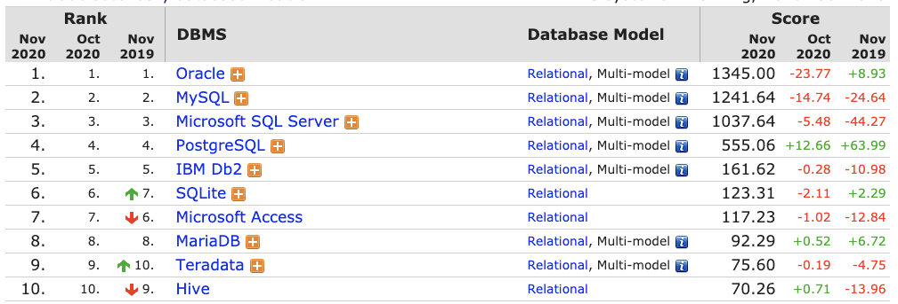 

### 2.3. MySQL Community vs MySQL Enterprise
Saat kita membuka halaman website resmi MySQL, jangan sampai salah download aplikasi MySQL
MySQL menawarkan pilihan versi MySQL Enterprise, yaitu DBMS MySQL Yang berbayar
MySQL yang versi gratis adalah MySQL Community
MySQL Enterprise sendiri lebih ke versi improvement dari MySQL Community, biasanya menambahkan support dan monitoring
Jika menggunakan MySQL Community, maka kita harus tangani semuanya sendiri, dari masalah dan monitoring MySQL nya

### 2.4. MySQL vs MariaDB
Tahun 2008 MySQL di akuisisi oleh perusahaan Sun Microsystem
Namun Tahun 2009, Sun Microsystem diakuisisi oleh perusahaan Oracle (Pemilik DBMS Oracle)
Hal ini menyebabkan 2 founder MySQL keluar dari MySQL dan membuat project baru bernama MariaDB
MariaDB Sebenarnya fork dari MySQL, jadi apa yang bisa dilakukan di MySQL bisa dilakukan di MariaDB
Sehingga sekarang jangan terlalu bingung jika ada MySQL dan MariaDB, karena sebenarnya itu dari source code yang sama, mungkin ada perbedaan kecil, namun secara garis besar sebenarnya tetap sama
https://mariadb.org/ 

### 2.5. Cara Kerja MySQL Server
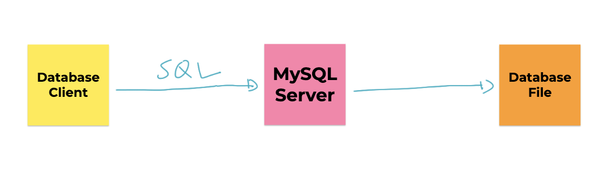

## 3. Menginstall MySQL

### 3.1. Menginstall MySQL
Menginstall MySQL banyak caranya, bisa download langsung dari halaman website resminya
Atau bisa menggunakan aplikasi yang mem-bundle MySQL seperti XAMPP yang biasa digunakan oleh programmer PHP
Jika sudah menginstall MySQL / MariaDB menggunakan XAMPP, tidak perlu menginstall lagi MySQL, karena jika bentrok, maka salah satu aplikasi MySQL nya tidak akan bisa jalan

### 3.2. Menginstall MySQL di Mac
Khusus untuk pengguna Mac, selain download installer MySQL di website resmi MySQL, kita juga bisa menggunakan homebrew untuk menginstall MySQL
Cukup gunakan perintah : brew install mysql

### 3.3. Menggunakan MySQL Client
MySQL Client adalah aplikasi berbasis terminal yang disediakan oleh MySQL untuk berkomunikasi dengan MySQL Server
Karena berbasis terminal, sehingga MySQL Client sangat cocok untuk kita gunakan misal ketika di server production, dimana kita menginstall MySQL di linux server yang berbasis terminal misal
Kita tidak perlu menginstall MySQL Client secara terpisah, karena sudah tersedia di dalam aplikasi MySQL ketika kita menginstallnya

### 3.4. MySQL Workbench
MySQL Workbench adalah aplikasi MySQL Client berbasis Desktop yang disediakan oleh MySQL 
MySQL Workbench adalah aplikasi gratis
Aplikasi MySQL Workbench sangat mempermudah kita melakukan manajemen data di MySQL karena berbasis Desktop
https://www.mysql.com/products/workbench/ 

### 3.5. JetBrains DataGrip
DataGrip adalah aplikasi Database Client yang berbayar
DataGrip mendukung banyak sekali DBMS sehingga kita cukup menggunakan DataGrip untuk manajemen semua database yang kita gunakan
Selain mendukung Relational DBMS, DataGrip juga mendukung DBMS yang NoSQL seperti MongoDB, Cassandra, dan lain-lain
https://www.jetbrains.com/datagrip/ 


## 4. Database

### 4.1. Database
Database adalah tempat kita menyimpan table di MySQL
Jika kita misalkan table di MySQL adalah sebuah file, maka database adalah folder nya, dimana kita bisa menyimpan banyak table di sebuah database
Biasanya pembuatan kita akan membuat satu database untuk satu jenis aplikasi, walaupun satu aplikasi bisa menggunakan lebih dari satu database, namun lumrahnya, satu aplikasi akan menggunakan satu database

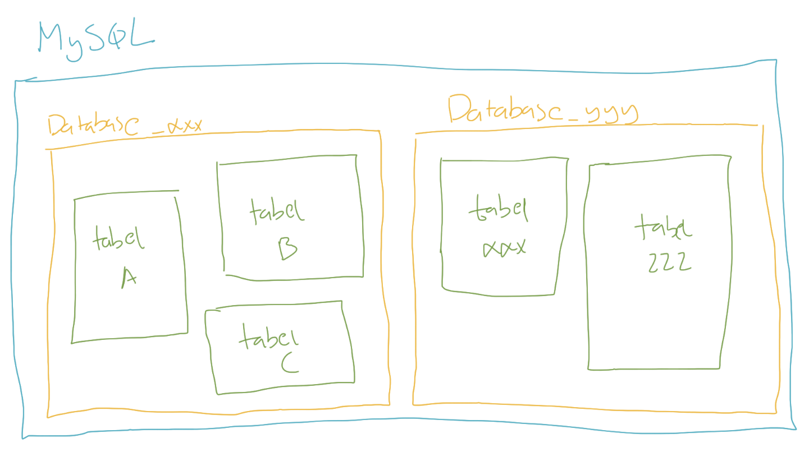


### 4.2. Melihat Semua Database di MySQL
```sql 
show databases;
```

### 4.3. Membuat Database
```sql
create database nama_database;
```
### 4.4. Memilih Database
```sql
use nama_database;
```

### 4.5. Menghapus Database
```sql
drop database nama_database;
```


## 5. Tipe Data

### 5.1. Tipe Data
Saat kita membuat tabel di Excel, kita bisa menentukan tipe data apa yang kita masukkan ke tiap kolom di Excel
Di MySQL, kita juga bisa menentukan tipe data tiap kolom yang kita buat di sebuah tabel
Ada banyak sekali tipe data yang tersedia di MySQL, dari yang sederhana, sampai yang kompleks.
Biasanya kita akan menggunakan tipe data sesuai dengan kebutuhan kolom yang perlu kita buat

### 5.2. Tipe Data per Kolom
| Id (number) | Nama (text) | Harga (number) | Jumlah (number) |
| :---------: | :---------: | :------------: | :-------------: |
|      1      |    Apel     |      5000      |       100       |
|      2      |    Jeruk    |      2000      |       200       |
|      3      |  Semangka   |     10000      |       50        |
|     ...     |     ...     |      ...       |       ...       |


### 5.3. Tipe Data Number
Secara garis besar, tipe data number di MySQL ada dua jenis;
Integer, atau tipe number bilangan bulat
Floating Point, atau tipe data number pecahan

### 5.4. Tipe Data Integer
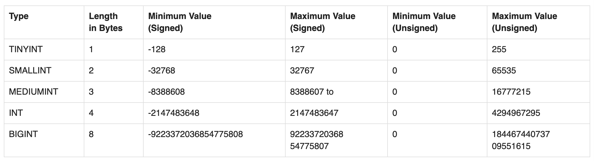
### 5.5. Tipe Data Floating Point
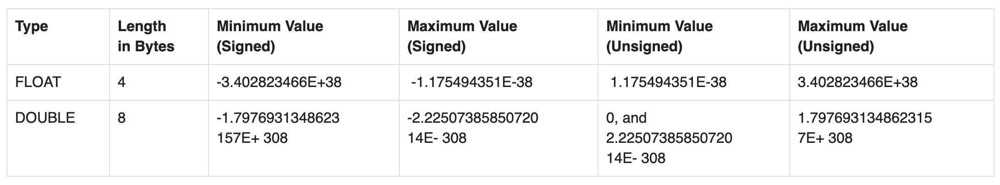


### 5.6. DECIMAL
Selain Integer dan Floating Point, di MySQL terdapat tipe data DECIMAL
Ini tipe data number khusus yang bisa ditentukan jumlah precision dan scale nya
|    DECIMAL    |   Min   |  Max   |
| :-----------: | :-----: | :----: |
| DECIMAL(5, 2) | -999.99 | 999.99 |
| DECIMAL(5, 0) | -99999  | 99999  |
| DECIMAL(3, 1) |  -99.9  |  999   |
|  DECIMAL(3)   |  -999   |  999   |

### 5.7. Number Attribute
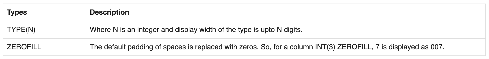

## 6. Tipe Data String
Selain number, biasanya kita sering menyimpan data di dalam tabel dalam bentuk tulisan
Tipe data ini namanya tipe data String atau Text
Ada banyak tipe data String di MySQL

### 6.1. CHAR dan VARCHAR
Pertama tipe data String di MySQL adalah CHAR dan VARCHAR
Kita bisa menentukan jumlah panjang maksimal karakter yang bisa ditampung oleh CHAR dan VARCHAR dengan menggunakan kurung buka lalu masukan jumlah maksimal karakter dan diakhiri kurung tutup
Misal, CHAR(10) atau VARCHAR(10) artinya tipe data String dengan maksimal jumlah karakternya adalah 10 karakter
Maksimum ukuran CHAR atau VARCHAR adalah 65535 karakter

### 6.2. Perbedaan CHAR dan VARCHAR
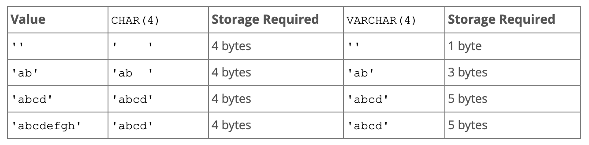

### 6.3. TEXT
Selain CHAR dan VARCHAR, tipe data String yang lainnya adalah TEXT
Berbeda dengan CHAR dan VARCHAR yang kita bisa tentukan panjang maksimum nya, TEXT tidak sudah memiliki maksimum  panjang nya
Terdapat 4 tipe data TEXT
TINYTEXT dengan maksimum 255 karakter (~256 bytes)
TEXT dengan maksimum 65535 karakter ( ~64 kb)
MEDIUMTEXT dengan maksimum 16777215 karakter (~16MB)
dan LONGTEXT dengan maksimum 4294967295 karakter (~4GB)

### 6.4. ENUM
ENUM adalah tipe data String yang bisa kita tentukan pilihan pilihannya
Misal kita bisa membuat 
ENUM(‘Pria’, ‘Wanita’), artinya hanya bisa menerima data Pria atau Wanita
ENUM(‘Programmer’, ‘Zaman’, ‘Now’), artinya hanya bisa menerima data Programmer, Zaman atau Now

## 7. Tipe Data Date dan Time

### 7.1. Tipe Data Date dan Time
Selain tipe data Number dan String, biasanya kadang kita sering menyimpan data waktu atau tanggal
Sebenarnya bisa kita gunakan String untuk menyimpan data waktu atau tanggal, namun itu tidak di rekomendasikan, karena akan menyulitkan kita ketika nanti butuh melakukan manipulasi waktu atau tanggal di MySQL

### 7.2. Jenis-Jenis Tipe Data Date dan Time
| Tipe Data Date dan Time |       Format        |       Contoh        |
| :---------------------: | :-----------------: | :-----------------: |
|          DATE           |     YYYY-MM-DD      |     2020-10-10      |
|        DATETIME         | YYYY-MM-DD HH:MM:SS | 2020-10-10 10:10:10 |
|        TIMESTAMP        | YYYY-MM-DD HH:MM:SS | 2020-10-10 10:10:10 |
|          TIME           |      HH:MM:SS       |      10:10:10       |
|          YEAR           |        YYYY         |        2020         |

https://stackoverflow.com/questions/409286/should-i-use-the-datetime-or-timestamp-data-type-in-mysql 


## 8. Tipe Data Boolean

### 8.1. Tipe Data Boolean
BOOLEAN adalah tipe data kebenaran, yang artinya datanya hanya ada dua jenis, benar atau salah
Benar direpresentasikan dengan data TRUE, sedangkan salah direpresentasikan dengan data FALSE

## 9. Tipe Data Lainnya

### 9.1. Dan Lain-Lain
Sebenarnya masih banyak jenis tipe data yang lain yang didukung oleh MySQL, namun itu bisa kita pelajari jika memang ada kebutuhan spesifik
Seperti misal tipe data BLOB, SPATIAL, JSON, SET dan lain-lain
https://dev.mysql.com/doc/refman/8.0/en/data-types.html 

## 10. Table

### 10.1. Table
Data biasanya disimpan di dalam tabel di MySQL
Tiap tabel biasanya menyimpan satu jenis data, misal ketika kita membuat aplikasi toko online, kita akan membuat tabel barang, tabel pelanggan, tabel penjual, dan lain-lain
Sebelum kita bisa memasukkan data ke tabel, kita wajib terlebih dahulu membuat tabelnya terlebih dahulu
Dan tiap tabel yang kita buat, wajib ditentukan kolom-kolom nya, dan tipe data tiap kolom nya
Kita juga bisa mengubah tabel yang sudah terlanjur dibuat, seperti menambah kolom baru, mengubah kolom yang sudah ada, atau menghapus kolom


### 10.2. Storage Engines
MySQL memiliki berbagai cara melakukan pengolahan data, hal ini disebut Storage Engines.
Saat ini, yang biasa dan populer digunakan adalah InnoDB
Untuk melihat storage engines apa saja yang terdapat di MySQL, kita bisa menggunakan perintah : SHOW ENGINES; 

### 10.3. Daftar Storage Engines


### 10.4. Melihat Table
```sql
SHOW TABLES;
```

### 10.5. Membuat Table
```sql
CREATE TABLE barang
(
    kode    INT,
    nama    VARCHAR(100),
    harga   INT,
    jumlah  INT
) ENGINE = InnoDB;
```


### 10.6. Melihat Struktur Table
```sql
DESCRIBE nama_tabel;
DESC nama_tabel;
SHOW CREATE TABLE nama_tabel;
```

### 10.7. Mengubah Table
```sql
ALTER TABLE barang 
    ADD COLUMN nama_column TEXT,
    DROP nama,
    RENAME COLUMN nama TO nama_baru,
    MODIFY nama VARCHAR(100) AFTER jumlah,
    MODIFY nama VARCHAR(100) FIRST;
```

### 10.8. Null Value
Null adalah nilai ketika kita tidak mengisi data ke dalam kolom
Secara default, saat kita membuat kolom, kolom tersebut bisa bernilai NULL, jika kita tidak ingin menerima nilai NULL, kita bisa menambahkan NOT NULL ketika pembuatan kolom nya
Null Value

### 10.9. Default Value
Saat kita menyimpan data ke dalam tabel, lalu kita hanya menyimpan beberapa kolom (tidak semuanya), kolom yang tidak kita beri nilai secara default nilainya adalah NULL
Jika kita ingin mengubah default value nya, kita bisa menambahkan perintah DEFAULT NILAI ketika pembuatan kolom nya
Khusus tipe data DATETIME atau TIMESTAMP, jika kita ingin menggunakan default value dengan nilai waktu saat ini, kita bisa gunakan kata kunci CURRENT_TIMESTAMP

### 10.10. Membuat Ulang Table
```sql
TRUNCATE nama_tabel;
```

### 10.11. Menghapus Table
```sql
DROP TABLE nama_tabel;
```

## 11. Insert Data

### 11.1. Insert Data
Sebelum kita meng memasukkan data kedalam tabel, tabel harus dibuat terlebih dahulu
Kita bisa menyebutkan kolom mana yang ingin kita isi, jika kita tidak menyebutkan kolom nya, artinya kolom tersebut tidak akan kita isi, dan secara otomatis kolom yang tidak kita isi, nilainya akan NULL, kecuali memiliki DEFAULT VALUE
Untuk memasukkan data kedalam tabel, kita bisa menggunakan perintah SQL yang bernama INSERT

### 11.2. Membuat Tabel Produk
```sql
CREATE TABLE products
(
    id          VARCHAR(10)  NOT NULL,
    name        VARCHAR(100) NOT NULL,
    description TEXT,
    price       INT UNSIGNED NOT NULL,
    quantity    INT UNSIGNED NOT NULL DEFAULT 0,
    created_at  TIMESTAMP    NOT NULL DEFAULT CURRENT_TIMESTAMP
) ENGINE = InnoDB;
```

### 11.3. Memasukkan Data
```sql
INSERT INTO products(id, name, price, quantity)
VALUES ('P0001', 'Mie Ayam Original', 15000, 100);
```

### 11.4. Memasukkan Beberapa Data Sekaligus
```sql
INSERT INTO products(id, name, price, quantity)
VALUES ('P0003', 'Mie Ayam Ceker', 20000, 100),
       ('P0004', 'Mie Ayam Spesial', 25000, 100),
       ('P0005', 'Mie Ayam Yamin', 15000, 100);
```

## 12. Select Data

### 12.1. Select Data
Untuk mengambil data di tabel, kita bisa menggunakan SQL dengan kata kunci SELECT
SELECT bisa digunakan untuk mengambil semua kolom yang ada di tabel, atau sebagian kolom saja
Jika kita ingin mengambil semua kolom, kita bisa gunakan karakter * (bintang)
Jika kita hanya ingin mengambil beberapa kolom saja, kita bisa sebutkan nama-nama kolom yang ingin kita ambil datanya

### 12.2. Mengambil Data
```sql
SELECT * FROM products;

SELECT id, name, price, quantity
FROM products;
```

## 13. Primary Key

### 13.1. Primary Key
Saat kita membuat tabel, idealnya tiap tabel memiliki Primary Key
Primary key adalah sebuah kolom yang kita tunjuk sebagai id dari tabel tersebut
Primary key adalah identitas untuk tiap baris data di dalam tabel
Primary key harus unik, tidak boleh ada data dengan primary key yang sama
Kita bisa menunjuk kolom yang akan kita jadikan primary key

### 13.2. Primary Key di Multiple Column
Kita bisa membuat primary key dengan kombinasi beberapa kolom
Namun disarankan untuk tetap menggunakan satu kolom ketika membuat primary key
Kecuali ada kasus khusus, seperti membuat tabel yang berelasi MANY TO MANY (yang nanti akan kita bahas)

### 13.3. Menambah Primary Key Ketika Membuat Tabel
```sql
CREATE TABLE products
(
    id          VARCHAR(10)  NOT NULL,
    name        VARCHAR(100) NOT NULL,
    description TEXT,
    price       INT UNSIGNED NOT NULL,
    quantity    INT UNSIGNED NOT NULL DEFAULT 0,
    created_at  TIMESTAMP    NOT NULL DEFAULT CURRENT_TIMESTAMP
    PRIMARY KEY(id)
) ENGINE = InnoDB;
```

### 13.4. Menambah Primary Key di Tabel
```sql
ALTER TABLE products
    ADD PRIMARY KEY (id);
```

## 14. Where Clause

### 14.1. Where Clause
Saat mengambil data menggunakan perintah SQL SELECT, kadang kita ingin melakukan pencarian data
Misal, kita ingin mengambil data barang yang harganya 1jt, atau mengambil data barang yang quantity nya 0 (stok nya kosong)
Hal ini bisa kita lakukan dengan WHERE clause setelah perintah SELECT

### 14.2. Mencari Data
```sql
SELECT *
FROM products
WHERE quantity = 100;
```

## 15. Update Data

### 15.1. Update Data
Untuk mengubah data di tabel, kita bisa menggunakan perintah SQL UPDATE
Saat menggunakan SQL UPDATE, kita harus memberi tahu data mana yang akan di update dengan WHERE clause
Hati-hati ketika meng-update data di table, jika sampai WHERE clause nya salah, bisa-bisa kita malah meng-update seluruh data di tabel
Untuk update, kita harus beritahu, kolom mana yang akan di update

### 15.2. Menambah Kolom Kategori
```sql
ALTER TABLE products
    ADD COLUMN category ENUM ('Makanan', 'Minuman', 'Lain-Lain')AFTER name;
```

### 15.3. Mengubah Satu Kolom
```sql
UPDATE products 
    SET category = 'Makanan'
    WHERE id = 'P0001';
```

### 15.4. Mengubah Beberapa Kolom
```sql
UPDATE products
SET category    = 'Makanan',
    description = 'Mie Ayam Original + Ceker'
WHERE id = 'P0003';
```

### 15.5. Mengubah Dengan Value di Kolom
```sql
UPDATE products
SET price = price + 5000
WHERE id = 'P0005';
```

## 16. Delete Data

### 16.1. Delete Data
Setelah kita tahu cara menambah, mengubah dan mengambil data di tabel, terakhir yang perlu kita ketahui adalah menghapus data di table
Untuk menghapus data di table, kita bisa menggunakan perintah SQL DELETE
Perintah SQL DELETE sama seperti UPDATE, kita perlu memberi tahu data mana yang akan di hapus dengan WHERE clause
Dan hati-hati, jangan sampai salah menentukan WHERE clause, karena jika salah, bisa-bisa kita akan menghapus seluruh data di table

### 16.2. Menghapus Data
```sql
DELETE
FROM products
WHERE id = 'P0009';
```

## 17. Alias

### 17.1. Alias
MySQL memiliki fitur untuk melakukan alias untuk kolom dan tabel
Alias berguna jika kita ingin mengubah nama kolom atau nama tabel ketika melakukan SELECT data
Mungkin saat ini alias untuk tabel tidak terlalu terlihat gunanya, tapi nanti ketika kita telah mempelajari tentang JOIN, maka fitur alias untuk tabel sangat berguna sekali

### 17.2. Alias untuk Kolom
```sql
SELECT id       AS Kode,
       name     AS Nama,
       category AS Kategori,
       price    AS Harga,
       quantity AS Jumlah
FROM products;
```

### 17.3. Alias untuk Tabel
```sql
SELECT p.id       AS Kode,
       p.name     AS Nama,
       p.category AS Kategori,
       p.price    AS Harga,
       p.quantity AS Jumlah
FROM products AS p;
```

## 18. Where Operator

### 18.1. Where Operator
Sebelumnya di materi where clause kita sudah menggunakan operator = (sama dengan)
Sebenarnya sangat banyak sekali operator yang bisa kita gunakan ketika menggunakan where clause
Sekarang kita akan bahas satu per satu

### 18.2. Operator Perbandingan
|  Operator  |          Keterangan          |
| :--------: | :--------------------------: |
|     =      |         Sama dengan          |
| <> atau != |      Tidak sama dengan       |
|     <      |         Kurang dari          |
|     <=     | Kurang dari atau sama dengan |
|     >      |          Lebih dari          |
|     >=     | Lebih dari atau sama dengan  |

### 18.3. Mencari Data dengan Operator Perbandingan
```sql
SELECT *
FROM products
WHERE quantity > 100;

SELECT *
FROM products
WHERE quantity >= 100;

SELECT *
FROM products
WHERE category != 'Makanan';

SELECT *
FROM products
WHERE category <> 'Minuman';
```

### 18.4. AND dan OR Operator
Kadang kita ingin mencari data dengan beberapa gabungan kondisi, kita bisa menggunakan operator AND dan OR
AND dan OR digunakan untuk menggabungkan beberapa dua operator

### 18.5. Hasil Operator AND 
| Hasil Operator 1 | Operator | Hasil Operator 2 | Hasil Akhir |
| :--------------: | :------: | :--------------: | :---------: |
|      Benar       |   AND    |      Benar       |    Benar    |
|      Salah       |   AND    |      Benar       |    Salah    |
|      Benar       |   AND    |      Salah       |    Salah    |
|      Salah       |   AND    |      Salah       |    Salah    |

### 18.6. Mencari Data dengan Operator AND
```sql
SELECT * FROM products
WHERE quantity > 100 AND price > 20000;

SELECT * FROM products
WHERE category = 'Makanan' AND price < 20000;
```

### 18.7. Hasil Operator OR 
| Hasil Operator 1 | Operator | Hasil Operator 2 | Hasil Akhir |
| :--------------: | :------: | :--------------: | :---------: |
|      Benar       |    OR    |      Benar       |    Benar    |
|      Salah       |    OR    |      Benar       |    Benar    |
|      Benar       |    OR    |      Salah       |    Benar    |
|      Salah       |    OR    |      Salah       |    Salah    |

### 18.8. Mencari Data dengan Operator OR
```sql
SELECT *
FROM products
WHERE quantity > 100 OR price > 20000;
```

### 18.9. Prioritas dengan Kurung ()
```sql
SELECT *
FROM products
WHERE (category = 'Makanan' OR quantity > 500) AND price > 20000;
```

### 18.10. LIKE Operator
LIKE operator adalah operator yang bisa kita gunakan untuk mencari sebagian data dalam String
Ini cocok sekali ketika kita hanya ingin mencari sebagian kata dalam String
Namun perlu diingat, operasi LIKE itu sangat lambat, oleh karena itu, tidak disarankan jika datanya sudah terlalu besar di tabel
Operasi LIKE tidak case sensitive, jadi huruf besar dan kecil tidak akan berpengaruh

### 18.11. Hasil Operator LIKE
| LIKE Operator |          Hasil          |
| :-----------: | :---------------------: |
|   LIKE ‘b%’   | String dengan awalan b  |
|   LIKE ‘%a’   | String dengan akhiran b |
| LIKE ‘%eko%’  |    String berisi eko    |
|   NOT LIKE    |       Tidak LIKE        |

### 18.12. Mencari Menggunakan LIKE Operator
```sql
SELECT *
FROM products
WHERE name LIKE '%mie%';

SELECT *
FROM products
WHERE name LIKE '%bakso%';

SELECT *
FROM products
WHERE name LIKE '%usu%';
```

### 18.13. NULL Operator
Untuk mencari data yang berisi NULL, kita tidak bisa menggunakan operator perbandingan = NULL.
Ada operator khusus untuk mencari data NULL, yaitu menggunakan NULL operator
IS NULL, artinya mencari yang NULL
IS NOT NULL, artinya mencari yang tidak NULL

### 18.14. Mencari Menggunakan NULL Operator
```sql
SELECT *
FROM products
WHERE description IS NULL;

SELECT *
FROM products
WHERE description IS NOT NULL;
```

### 18.15. BETWEEN Operator
Kadang kita ingin mencari data yang >= dan <= secara sekaligus
Misal kita ingin mencari products yang harganya antara 10000 sampai 20000
Untuk melakukan ini, kita bisa menggunakan WHERE price >= 10000 AND price <= 20000
Namun ada operator BETWEEN yang bisa kita gunakan agar lebih sederhana
Untuk kebalikannya, kita bisa gunakan NOT BETWEEN

### 18.16. Mencari Menggunakan BETWEEN Operator
```sql
SELECT *
FROM products
WHERE price BETWEEN 10000 AND 20000;

SELECT *
FROM products
WHERE price NOT BETWEEN 10000 AND 20000;
```

### 18.17. IN Operator
Operator IN adalah operator untuk melakukan pencarian sebuah kolom dengan beberapa nilai.
Misal kita ingin mencari products dengan category Makanan atau Minuman, maka kita bisa menggunakan operator IN

### 18.18. Mencari Menggunakan IN Operator
```sql
SELECT *
FROM products
WHERE category IN ('Makanan', 'Minuman');

SELECT *
FROM products
WHERE category NOT IN ('Makanan', 'Minuman');
```

## 19. Order By Clause

### 19.1. Order By Clause
Untuk mengurutkan data ketika kita menggunakan perintah SQL SELECT, kita bisa menambahkan ORDER BY clause
ORDER BY clause digunakan untuk mengurutkan data berdasarkan kolom yang dipilih, dan jenis urutan (ASC atau DESC)
Kita juga bisa mengurutkan tidak hanya terhadap satu kolom, tapi beberapa kolom

### 19.2. Mengurutkan Data
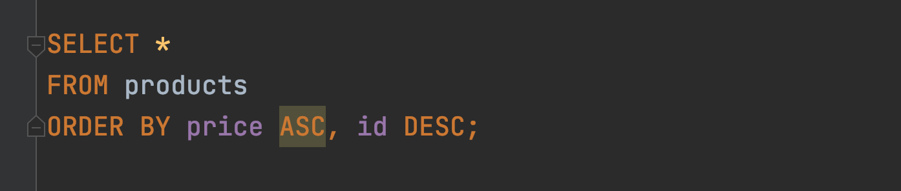

## 20. Limit Clause

### 20.1. Limit Clause
Mengambil seluruh data di tabel bukanlah pilihan bijak, apalagi jika datanya sudah banyak sekali
Kita bisa membatasi jumlah data yang diambil dalam SQL SELECT dengan LIMIT clause
Selain membatasi jumlah data, kita juga bisa meng-skip sejumlah data yang tidak ingin kita lihat
LIMIT biasanya digunakan saat melakukan paging di aplikasi kita

### 20.2. Membatasi Hasil Query


### 20.3. Skip Hasil Query
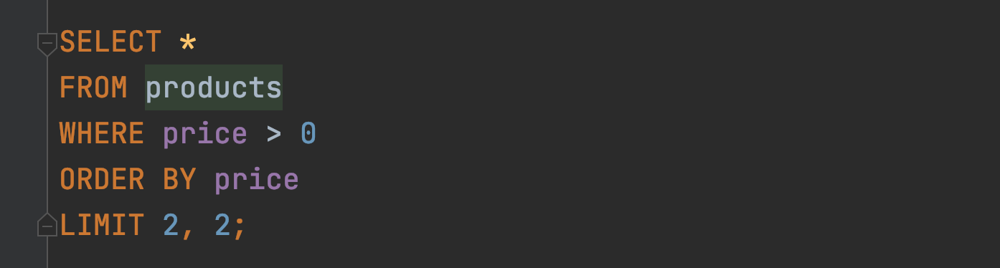

## 21. Select Distinct Data

### 21.1. Select Distinct Data
Saat melakukan query dengan SELECT, kadang kita mendapatkan data yang duplikat
Misal kita ingin melihat semua kategori di tabel products, maka otomatis hasil query SELECT akan duplikat, karena banyak sekali produk dengan kategori yang sama
Jika kita ingin menghilangkan data-data duplikat tersebut , kita bisa menggunakan SELECT dengan tambahan DISTINCT sebelum nama kolom nya

### 21.2. Menghilangkan Data Duplikat


## 22. Numeric Function

### 22.1. Numeric Function
MySQL memiliki banyak sekali fitur untuk manipulasi data angka
Hal ini memudahkan kita untuk memanipulasi data angka
Secara garis besar, fitur ini dibagi menjadi dua, Arithmetic Operator dan Mathematical Function

### 22.2. Arithmetic Operator
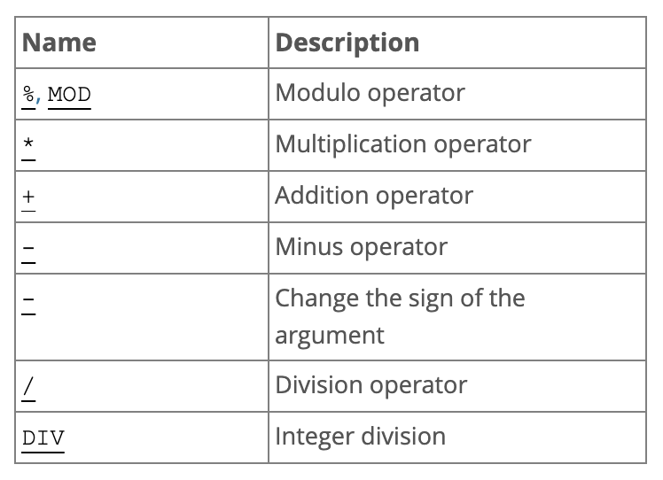

### 22.3. Menggunakan Arithmetic Operator
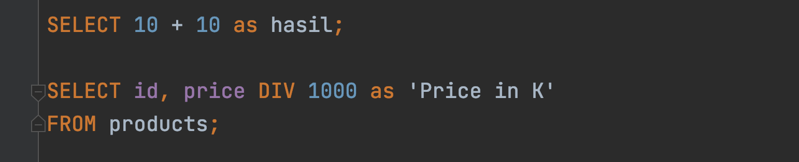

### 22.4. Mathematical Function
Selain arithmetic operator, ada juga mathematical function
Ini adalah kumpulan function yang terdapat di MySQL yang bisa kita gunakan sebagai fungsi-fungsi matematika
Ada banyak sekali, dan tidak bisa kita bahas semua
https://dev.mysql.com/doc/refman/8.0/en/mathematical-functions.html 

### 22.5. Menggunakan Mathematical Function
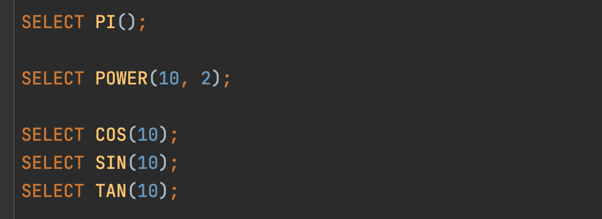

## 23. Auto Increment

### 23.1. Auto Increment
Kadang kita butuh angka yang berurut untuk membuat primary key, misal 1, 2, 3, dan seterusnya.
Untuk melakukan hal ini secara manual bukanlah hal bijak, apalagi jika aplikasi yang kita buat diakses oleh banyak orang secara bersamaan
MySQL memiliki fitur yang bernama auto increment, fitur ini bisa kita gunakan untuk menandai bahwa suatu primary key datanya diisi secara otomatis dari angka terakhir + 1
Dengan menggunakan auto increment, kita tidak perlu lalu memasukkan data primary key, ini akan otomatis dibuat oleh MySQL

### 23.2. Membuat Tabel dengan Auto Increment
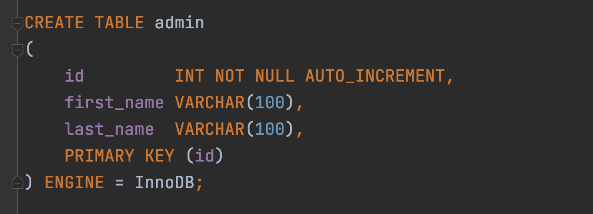

### 23.3. Memasukkan Data Tanpa Id
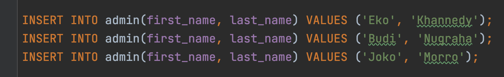

### 23.4. Melihat Id Terakhir


## 24. String Function

### 24.1. String Function
Sama seperti number, di MySQL juga banyak menyediakan function untuk tipe data String
Ada banyak sekali function-function yang bisa kita gunakan
https://dev.mysql.com/doc/refman/8.0/en/string-functions.html 

### 24.2. Menggunakan String Function
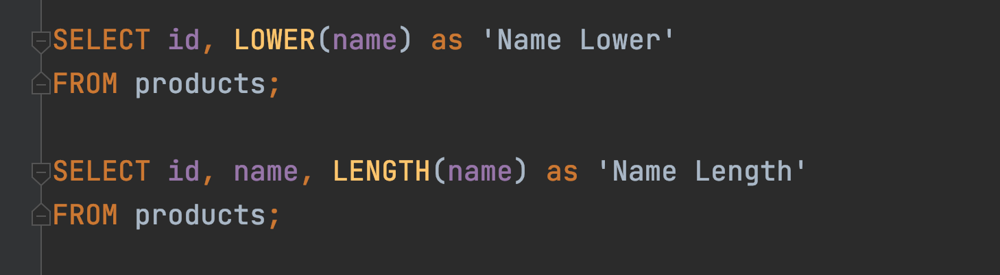

## 25. Date and Time Functions

### 25.1. Date dan Time Function
MySQL juga menyediakan banyak sekali function yang bisa kita gunakan untuk mengolah data tipe Date dan Time
https://dev.mysql.com/doc/refman/8.0/en/date-and-time-functions.html 

### 25.2. Menambah Kolom Timestamp 
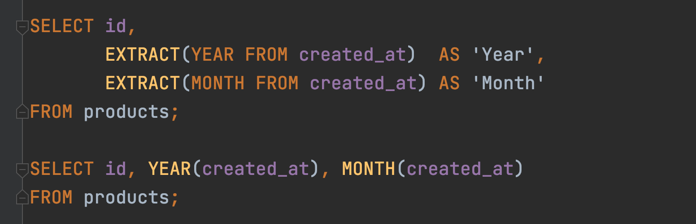

## 26. Flow Control Function

### 26.1. Flow Control Function
MySQL memiliki fitur flow control function
Ini mirip IF ELSE di bahasa pemrograman
Tapi ingat, fitur ini tidak se kompleks yang dimiliki bahasa pemrograman
https://dev.mysql.com/doc/refman/8.0/en/flow-control-functions.html 

### 26.2. Menggunakan Control Flow CASE 
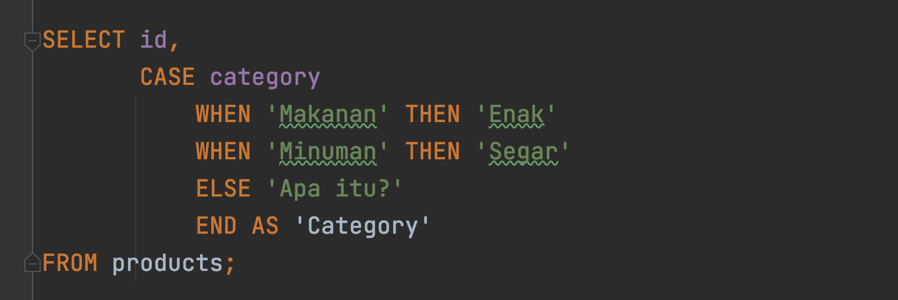

### 26.3. Menggunakan Control Flow IF
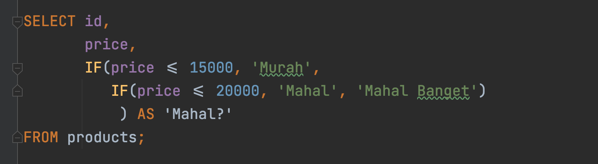

### 26.4. Menggunakan Control Flow IFNULL


## 27. Aggregate Function

### 27.1. Aggregate Function
MySQL mendukung function-function untuk melakukan aggregate
Misal, kita ingin melihat harga paling mahal di tabel product, atau harga termurah, atau rata-rata harga produk, atau total jumlah data di tabel, dan lain-lain
https://dev.mysql.com/doc/refman/8.0/en/aggregate-functions.html 

### 27.2. Menggunakan Aggregate Function
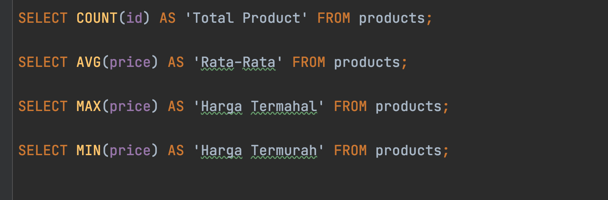

## 28. Grouping

### 28.1. GROUP BY
Kadang saat melakukan aggregate, kita ingin datanya di grouping berdasarkan kriteria tertentu
Misal kita ingin melihat rata-rata harga product, tapi ingin per category
Atau kita ingin melihat total semua product, tapi per category
Hal ini bisa dilakukan di MySQL dengan menggunakan GROUP BY clause
GROUP BY clause ini hanya bisa digunakan jika kita menggunakan aggregate function
https://dev.mysql.com/doc/refman/8.0/en/group-by-modifiers.html 

### 28.2. Menggunakan GROUP BY
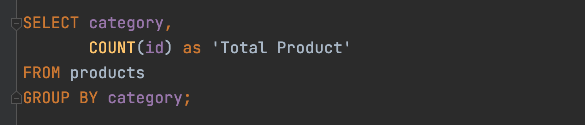

### 28.3. HAVING Clause
Kadang kita ingin melakukan filter terhadap data yang sudah kita grouping
Misal kita ingin menampilkan rata-rata harga per kategori, tapi yang harganya diatas 10.000 misalnya
Jika menggunakan WHERE di SELECT, hal ini tidak bisa dilakukan
Untuk memfilter hasil aggregate function, kita harus menggunakan HAVING clause

### 28.4. Menggunakan HAVING Clause
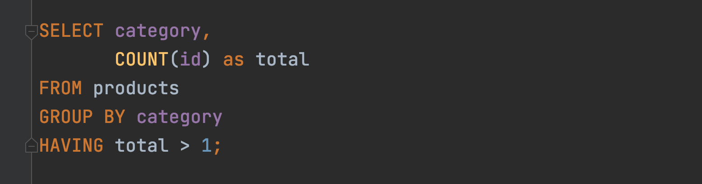

## 29. Constraint

### 29.1. Constraint
Di MySQL, kita bisa menambahkan constraint untuk menjaga data di tabel tetap baik
Constraint sangat bagus ditambahkan untuk menjaga terjadi validasi yang salah di program kita, sehingga data yang masuk ke database tetap akan terjaga

### 29.2. Unique Constraint
Unique constraint adalah constraint yang memastikan bahwa data kita tetap unique
Jika kita mencoba memasukkan data yang duplikat, maka MySQL akan menolak data tersebut

### 29.3. Membuat Table dengan Unique Constraint


### 29.4. Menambah/Menghapus Unique Constraint
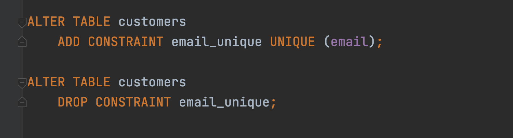

### 29.5. Check Constraint
Check constraint adalah constraint yang bisa kita tambahkan kondisi pengecekannya
Ini cocok untuk mengecek data sebelum dimasukkan ke dalam database
Misal kita ingin memastikan bahwa harga harus diatas 1000 misal
Maka kita bisa menggunakan check constraint

### 29.6. Membuat Table dengan Check Constraint


### 29.7. Menambah/Menghapus Check Constraint
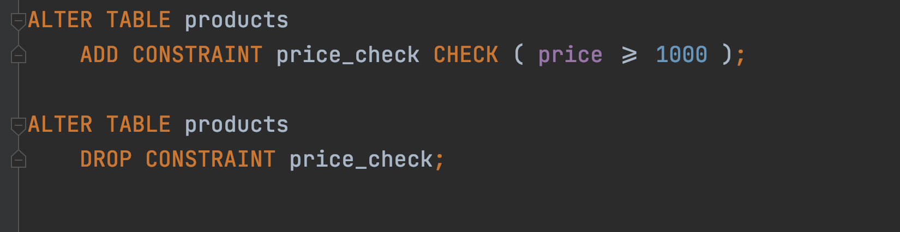

## 30. Index

### 30.1. Index
Secara default, MySQL akan menyimpan data di dalam disk seperti tabel biasanya
Hal ini menyebabkan, ketika kita mencari data, maka MySQL akan melakukan pencarian dari baris pertama sampai terakhir, yang artinya semakin banyak datanya, maka akan semakin lambat proses pencarian datanya
Saat kita membuat index, MySQL akan menyimpan data dalam struktur data B-Tree : https://en.wikipedia.org/wiki/B-tree 
Tidak hanya akan mempermudah kita saat melakukan pencarian, index juga akan mempermudah kita ketika melakukan pengurutan menggunakan ORDER BY
https://dev.mysql.com/doc/refman/8.0/en/optimization-indexes.html 

### 30.2. Cara Kerja Index
Kita bisa membuat lebih dari satu index di table, dan setiap kita membuat index, kita bisa membuat index untuk beberapa kolom sekaligus
Misal kita membuat index
(col1, col2, col3)
Artinya kita punya kemampuan untuk mencari lebih menggunakan index untuk kombinasi query di (col1), (col1, col2) dan (col1, col2, col3)

### 30.3. Efek Samping Membuat Index
Index mungkin akan mempercepat untuk proses pencarian dan query data
Namun, saat kita membuat index, artinya MySQL akan melakukan proses update data di index tiap kali kita menambah, mengubah atau menghapus data di table
Artinya Index membuat proses pencarian dan query lebih cepat, tapi memperlambat proses manipulasi data
Oleh karena itu, kita harus bijak saat membuat index

### 30.4. Tidak Perlu Index
Saat kita membuat PRIMARY KEY dan UNIQUE constraint, kita tidak perlu menambahkan lagi index
Hal ini dikarenakan MySQL secara otomatis akan menambahkan index pada kolom PRIMARY KEY dan UNIQUE constraint

### 30.5. Membuat Table dengan Index
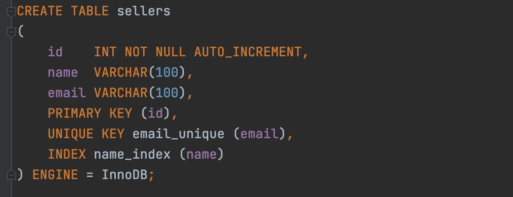

### 30.6. Menambah/Menghapus Index
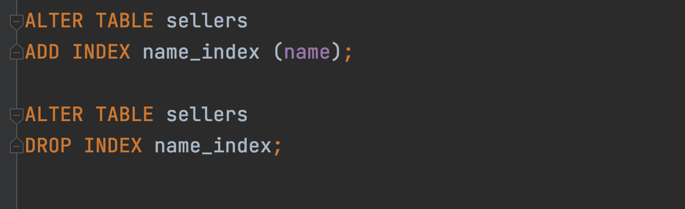

## 31. Full-Text Search

### 31.1. Masalah dengan LIKE operator
Kadang kita ingin mencari sebuah kata dalam tabel, dan biasanya kita akan menggunakan LIKE operator
Operasi yang dilakukan LIKE operator adalah dengan cara mencari seluruh data di tabel dari baris pertama sampai terakhir, hal ini membuat operasi LIKE sangat lambat
Menambah index di tabel juga tidak akan membantu, karen LIKE operator tidak menggunakan index
MySQL menyediakan fitur Full Text Search jika ada kasus kita ingin melakukan hal ini

### 31.2. Full-Text Search
Full-Text Search memungkinkan kita bisa mencari sebagian kata di kolom dengan tipe data String
Ini sangat cocok ketika pada kasus kita memang membutuhkan pencarian yang tidak hanya sekedar operasi = (equals, sama dengan)
https://dev.mysql.com/doc/refman/8.0/en/fulltext-search.html 

### 31.3. Membuat Table dengan Full-Text Search
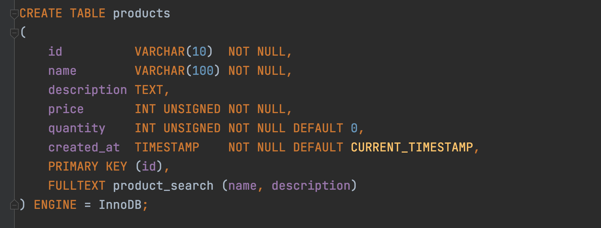

### 31.4. Menambah/Menghapus Full-Text Search
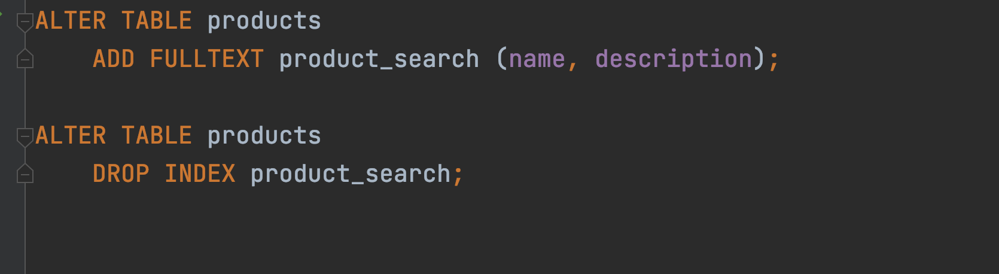

### 31.5. Mode Full-Text Search
MySQL menyediakan beberapa mode untuk melakukan pencarian di Full-Text Search, kita bisa memilihnya sesuai kebutuhan kita
Natural Language, yaitu mencari seperti bahasa natural (per kata) : https://dev.mysql.com/doc/refman/8.0/en/fulltext-natural-language.html 
Boolean, yaitu mencari dengan kemampuan mengandung kata (+) atau tidak mengandung kata (-) dan lain-lain : https://dev.mysql.com/doc/refman/8.0/en/fulltext-boolean.html 
Query Expansion, yaitu mencari seperti natural language, namun melakukan dua kali pencarian, pencarian pertama menggunakan natural language, pencarian kedua melakukan pencarian dari kedekatan hasil pertama, misal kita mencari kata “bakso”, lalu ternyata di dalam “bakso” ada kata “mie”, maka kemungkinan query kedua akan mencari kata “mie” juga : https://dev.mysql.com/doc/refman/8.0/en/fulltext-query-expansion.html 

### 31.6. Mencari dengan Natural Language Mode
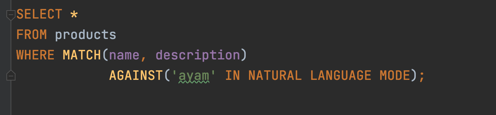

### 31.7. Mencari dengan Boolean Mode


### 31.8. Mencari dengan Query Expansion Mode


## 32. Table Relationship

### 32.1. Table Relationship
Dalam Relational DBMS, salah satu fitur andalan nya adalah table relationship. Yaitu relasi antar tabel
Kita bisa melakukan relasi dari satu tabel ke tabel lain.
Dalam kehidupan nyata pun pasti kita akan sering membuat relasi antar tabel
Misal, saat kita membuat aplikasi penjualan, di laporan penjualan pasti ada data barang. Jika di tabel artinya tabel penjualan akan berelasi dengan tabel barang
Misal dalam aplikasi kampus, tabel mahasiswa akan berelasi dengan tabel mata kuliah, dan tabel dosen
Dan lain-lain

### 32.2. Foreign Key
Saat membuat relasi tabel, biasanya kita akan membuat sebuah kolom sebagai referensi ke tabel lainnya
Misal saat kita membuat tabel penjualan, di dalam tabel penjualan, kita akan menambahkan kolom id_produk sebagai referensi ke tabel produk, yang berisi primary key di tabel produk
Kolom referensi ini di MySQL dinamakan Foreign Key
Kita bisa menambah satu satu lebih foreign key ke dalam sebuah tabel
Membuat foreign key sama seperti membuat kolom biasanya, hanya saja kita perlu memberi tahu MySQL bahwa itu adalah foreign key ke tabel lain

### 32.3. Membuat Table dengan Foreign Key


### 32.4. Menambah/Menghapus Foreign Key


Keuntungan Menggunakan Foreign Key
Foreign key memastikan bahwa data yang kita masukkan ke kolom tersebut harus tersedia di tabel reference nya
Selain itu saat kita menghapus data di tabel reference, MySQL akan mengecek apakah id nya digunakan di foreign key di tabel lain, jika digunakan, maka secara otomatis MySQL akan menolak proses delete data di tabel reference tersebut

### 32.5. Ketika Menghapus Data Berelasi
Seperti yang sebelumnya dibahas, ketika kita menghapus data yang berelasi, maka secara otomatis MySQL akan menolak operasi delete tersebut
Kita bisa mengubah fitur ini jika kita mau, ada banyak hal yang bisa dilakukan ketika data berelasi dihapus, defaultnya memang akan ditolak (RESTRICT)

### 32.6. Behavior Foreign Key
| Behavior  |     ON DELETE     |       ON UPDATE       |
| :-------: | :---------------: | :-------------------: |
| RESTRICT  |      Ditolak      |        Ditolak        |
|  CASCADE  | Data akan dihapus | Data akan ikut diubah |
| NO ACTION |  Data dibiarkan   |    Data dibiarkan     |
| SET NULL  | Diubah jadi NULL  |   Diubah jadi NULL    |

### 32.7. Mengubah Behavior Menghapus Relasi


## 33. Join

### 33.1. Join
MySQL mendukung query SELECT langsung ke beberapa tabel secara sekaligus
Namun untuk melakukan itu, kita perlu melakukan JOIN di SQL SELECT yang kita buat
Untuk melakukan JOIN, kita perlu menentukan tabel mana yang merupakan referensi ke tabel lain
Join cocok sekali dengan foreign key, walaupun di MySQL tidak ada aturan kalau JOIN harus ada foreign key
Join di MySQL bisa dilakukan untuk lebih dari beberapa tabel
Tapi ingat, semakin banyak JOIN, maka proses query akan semakin berat dan lambat, jadi harap bijak ketika melakukan JOIN
Idealnya kita melakukan JOIN jangan lebih dari 5 tabel, karena itu bisa berdampak ke performa query yang lambat

### 33.2. Melakukan JOIN Table


### 33.3. Membuat Relasi ke Table Customers


### 33.4. Melakukan JOIN Multiple Table


## 34. One to One Relationship

### 34.1. Jenis-Jenis Relasi Tabel
Sekarang kita sudah tau untuk melakukan relasi antar tabel, kita bisa menggunakan FOREIGN KEY
Dan untuk melakukan SELECT beberapa tabel, kita bisa menggunakan JOIN
Dalam konsep relasi, ada banyak jenis-jenis relasi antar tabel
Sekarang kita akan bahas dari yang pertama yaitu One to One relationship

### 34.2. One to One Relationship
One to One relationship adalah relasi antar tabel yang paling sederhana
Artinya tiap data di sebuah tabel hanya boleh berelasi ke maksimal 1 data di tabel lainnya
Tidak boleh ada relasi lebih dari 1 data
Contoh misal, kita membuat aplikasi toko online yang terdapat fitur wallet, dan 1 customer, cuma boleh punya 1 wallet

### 34.3. Diagram One to One Relationship


### 34.4. Membuat One to One Relationship
Cara membuat One to One relationship cukup mudah
Kita bisa membuat kolom foreign key, lalu set kolom tersebut menggunakan UNIQUE KEY, hal ini dapat mencegah terjadi data di kolom tersebut agar tidak duplikat
Atau cara lainnya, kita bisa membuat tabel dengan primary key yang sama, sehingga tidak butuh lagi kolom untuk FOREIGN KEY

### 34.5. Membuat Table Wallet


## 35. One to Many Relationship

### 35.1. One to Many Relationship
One to many relationship adalah relasi antar tabel dimana satu data bisa digunakan lebih dari satu kali di tabel relasinya
Berbeda dengan one to one yang cuma bisa digunakan maksimal 1 kali di tabel relasinya, one to many tidak ada batasan berapa banyak data digunakan
Contoh relasi antar tabel categories dan products, dimana satu category bisa digunakan oleh lebih dari satu product, yang artinya relasinya nya one category to many products
Pembuatan relasi one to many sebenarnya sama dengan one to one, yang membedakan adalah, kita tidak perlu menggunakan UNIQUE KEY, karena datanya memang bisa berkali-kali ditambahkan di tabel relasi nya

### 35.2. Diagram One to Many Relationship


### 35.3. Membuat Table Category


### 35.4. Mengubah Tabel Product


## 36. Many to Many Relationship

### 36.1. Many to Many Relationship
Many to Many adalah table relationship yang paling kompleks, dan kadang membingungkan untuk pemula
Many to Many adalah relasi dimana ada relasi antara 2 tabel dimana table pertama bisa punya banyak relasi di table kedua, dan table kedua pun punya banyak relasi di table pertama
Ini memang sedikit membingungkan, bagaimana caranya bisa relasi kebanyakan secara bolak balik, sedangkan di table kita cuma punya 1 kolom?
Contoh relasi many to many adalah relasi antara produk dan penjualan, dimana setiap produk bisa dijual berkali kali, dan setiap penjualan bisa untuk lebih dari satu produk

### 36.2. Diagram Many to Many Relationship


### 36.3. Bagaimana Implementasi Many to Many?
Sekarang pertanyaannya, bagaimana implementasi many to many?
Apakah kita harus menambahkan id_order di table products? atau id_product di table orders?

### 36.4. Id Product di Table Order
Jika kita menambahkan id_product di table orders, artinya sekarang sudah benar, bahwa 1 product bisa dijual berkali-kali
Namun masalahnya adalah, berarti 1 order hanya bisa membeli 1 product, karena cuma ada 1 kolom untuk id_product
Oke kalo gitu kita tambahkan id_product1, id_product2, dan seterusnya. Solusi ini bisa dilakukan, tapi tidak baik, artinya akan selalu ada maksimal barang yang bisa kita beli dalam satu order

### 36.5. Id Order di Table Product
Jika kita tambahkan id_order di table products, artinya sekarang 1 order bisa membeli lebih dari 1 product, oke sudah benar
Tapi sayangnya masalahnya terbalik sekarang, 1 product cuma bisa dijual satu kali, tidak bisa dijual berkali-kali, karena kolom id_order nya cuma 1
Kalupun kita tambah id_order1, id_order2 dan seterusnya di table product, tetap ada batasan maksimal nya
Lantai bagaimana solusinya untuk relasi many to many?

### 36.6. Membuat Table Relasi
Solusi yang biasa dilakukan jika terjadi relasi many to many adalah, biasanya kita akan menambah 1 tabel ditengahnya
Tabel ini bertugas sebagai jembatan untuk menggabungkan relasi many to many
Isi table ini akan ada id dari table pertama dan table kedua, dalam kasus ini adalah id_product dan id_order
Dengan demikian, kita bisa menambahkan beberapa data ke dalam tabel relasi ini, sehingga berarti satu product bisa dijual beberapa kali di dalam table order, dan satu order bisa membeli lebih dari satu product

### 36.7. Diagram Many to Many Relationship


### 36.8. Membuat Table Order


### 36.9. Membuat Table Order Detail


### 36.10. Membuat Foreign Key


### 36.11. Melihat Data Order, Detail dan Product-nya


## 37. Jenis-Jenis Join

### 37.1. Jenis-Jenis Join
Sebelumnya kita sudah bahas tentang JOIN table, tapi sebenarnya ada banyak sekali jenis-jenis JOIN table di MySQL, diantaranya :
* INNER JOIN
* LEFT JOIN
* RIGHT JOIN
* CROSS JOIN

### 37.2. Inner Join
INNER JOIN adalah mekanisme JOIN, dimana terdapat relasi antara tabel pertama dan tabel kedua
Jika ada data di tabel pertama yang tidak memiliki relasi di table kedua ataupun sebaliknya, maka hasil INNER JOIN tidak akan ditampilkan
Ini adalah default JOIN di MySQL
Jika kita menggunakan JOIN seperti yang sudah kita praktekan sebelumnya, sebenarnya itu akan melakukan INNER JOIN

### 37.3. Inner Join Diagram


### 37.4. Melakukan Inner Join


### 37.5. Left Join
LEFT JOIN adalah mekanisme JOIN seperti INNER JOIN, namun semua data di table pertama akan diambil juga
Jika ada yang tidak memiliki relasi di table kedua, maka hasilnya akan NULL

### 37.6. Left Join Diagram


### 37.7. Melakukan Left Join


### 37.8. Right Join
RIGHT JOIN adalah mekanisme JOIN seperti INNER JOIN, namun semua data di table kedua akan diambil juga
Jika ada yang tidak memiliki relasi di table pertama, maka hasilnya akan NULL

### 37.9. Right Join Diagram


### 37.10. Melakukan Right Join


### 37.11. Cross Join
CROSS JOIN adalah salah satu JOIN yang sangat jangan sekali digunakan
CROSS JOIN adalah melakukan join dengan cara mengkalikan data di tabel pertama dengan dada di table kedua
Artinya jika ada 5 data di tabel pertama, dan 5 data di tabel kedua, akan menghasilkan 25 kombinasi data (5 x 5)
Sekali lagi perlu diingat, ini adalah JOIN yang sangat jarang sekali digunakan

### 37.12. Menggunakan Cross Join


### 37.13. Membuat Tabel Perkalian


### 37.14. Cross Join Tabel Perkalian


## 38. Subqueries

### 38.1. Subquery di WHERE
MySQL mendukung pencarian data menggunakan WHERE dari hasil SELECT query
Fitur ini dinamakan Subquery
Contoh, kita ingin mencari products yang harganya diatas harga rata-rata, artinya kita akan melakukan SELECT dengan WHERE price > harga rata, dimana harga rata-rata perlu kita hitung menggunakan query SELECT lainnya menggunakan aggregate function AVG

### 38.2. Melakukan Subquery di WHERE Clause


### 38.3. Subquery di FROM
Selain di WHERE clause, Subquery juga bisa dilakukan di FROM clause
Misal kita ingin mencari data dari hasil query SELECT, itu bisa kita lakukan di MySQL

### 38.4. Melakukan Subquery di FROM Clause


## 39. Set Operator

### 39.1. Set Operator
MySQL mendukung operator Set, dimana ini adalah operasi antara hasil dari dua SELECT query. Ada banyak jenis operator Set, yaitu :
* UNION
* UNION ALL
* INTERSECT, dan
* MINUS

### 39.2. Membuat Table Guest Book


### 39.3. UNION
UNION adalah operasi menggabungkan dua buah SELECT query, dimana jika terdapat data yang duplikat, data duplikatnya akan dihapus dari hasil query

### 39.4. Diagram UNION


### 39.5. Melakukan Query UNION


### 39.6. UNION ALL
UNION ALL adalah operasi yang sama dengan UNION, namun data duplikat tetap akan ditampilkan di hasil query nya

### 39.7. Diagram UNION ALL


### 39.8. Melakukan Query UNION ALL


### 39.9. INTERSECT
INTERSECT adalah operasi menggabungkan dua query, namun yang diambil hanya data yang terdapat pada hasil query pertama dan query kedua
Data yang tidak hanya ada di salah satu query, kan dihapus di hasil operasi INTERSECT 
Data nya muncul tidak dalam keadaan duplikat
Sayangnya, MySQL tidak memiliki operator INTERSECT, dengan demikian untuk melakukan operasi INTERSECT, kita harus lakukan secara manual menggunakan JOIN atau SUBQUERY

### 39.10. Diagram INTERSECT


### 39.11. Melakukan Query INTERSECT


### 39.12. MINUS
MINUS adalah operasi dimana query pertama akan dihilangkan oleh query kedua
Artinya jika ada data di query pertama yang sama dengan data yang ada di query kedua, maka data tersebut akan dihapus dari hasil query MINUS
Sayang nya, di MySQL juga tidak ada operator MINUS, namun hal ini bisa kita lakukan menggunakan JOIN

### 39.13. Diagram MINUS


### 39.14. Melakukan Query MINUS


## 40. Transaction

### 40.1. Kenapa Butuh Transaction?
Saat membuat aplikasi berbasis database, jarang sekali kita akan melakukan satu jenis perintah SQL per aksi yang dibuat aplikasi
Contoh, ketika membuat toko online, ketika customer menekan tombol Pesan, banyak yang harus kita lakukan, misal
Membuat data pesanan di tabel order
Membuat data detail pesanan di tabel order detail
Menurunkan quantity di tabel produk
Dan yang lainnya
Artinya, bisa saja dalam satu aksi, kita akan melakukan beberapa perintah sekaligus
Jika terjadi kesalahan di salah satu perintah, harapannya adalah perintah-perintah sebelumnya dibatalkan, agar data tetap konsisten

### 40.2. Database Transaction
Database transaction adalah fitur di DBMS dimana kita bisa memungkinan beberapa perintah dianggap menjadi sebuah kesatuan perintah yang kita sebut transaction
Jika terdapat satu saja proses gagal di transaction, maka secara otomatis perintah-perintah sebelumnya akan dibatalkan
Jika sebuah transaction sukses, maka semua perintah akan dipastikan sukses

### 40.3. Membuat Transaction


### 40.4. Membatalkan Transaction


### 40.5. Transaction di MySQL
|     Perintah      |                                                Keterangan                                                 |
| :---------------: | :-------------------------------------------------------------------------------------------------------: |
| START TRANSACTION | Memulai proses transaksi, proses selanjutnya akan dianggap transaksi sampai perintah COMMIT atau ROLLBACK |
|      COMMIT       |                            Menyimpan secara permanen seluruh proses transaksi                             |
|     ROLLBACK      |                           Membatalkan secara permanen seluruh proses transaksi                            |

### 40.6. Yang Tidak Bisa Menggunakan Transaction
Perintah DDL (Data Definition Language) tidak bisa menggunakan fitur transaction
DDL adalah perintah-perintah yang digunakan untuk merubah struktur, seperti membuat tabel, menambah kolom, menghapus tabel, menghapus database, dan sejenisnya
Transaction hanya bisa dilakukan pada perintah DML (Data Manipulation Language), seperti operasi INSERT, UPDATE dan DELETE

## 41. Locking

### 41.1. Locking
Locking adalah proses mengunci data di DBMS
Proses mengunci data sangat penting dilakukan, salah satunya agar data benar-benar terjamin konsistensinya
Karena pada kenyataannya, aplikasi yang akan kita buat pasti digunakan oleh banyak pengguna, dan banyak pengguna tersebut bisa saja akan mengakses data yang sama, jika tidak ada proses locking, bisa dipastikan akan terjadi RACE CONDITION, yaitu proses balapan ketika mengubah data yang sama
Contoh saja, ketika kita belanja di toko online, kita akan balapan membeli barang yang sama, jika data tidak terjaga, bisa jadi kita salah mengupdate stock karena pada saat yang bersamaan banyak yang melakukan perubahan stock barang

### 41.2. Locking Record
Saat kita melakukan proses TRANSACTION, lalu kita melakukan prose perubahan data, data yang kita ubah tersebut akan secara otomatis di LOCK
Hal ini membuat proses TRANSACTION sangat aman
Oleh karena itu, sangat disarankan untuk selalu menggunakan fitur TRANSACTION ketika memanipulasi data di database, terutama ketika perintah manipulasinya lebih dari satu kali
Locking ini akan membuat sebuah proses perubahan yang dilakukan oleh pihak lain akan diminta untuk menunggu 
Data akan di lock sampai kita melakukan COMMIT atau ROLLBACK transaksi tersebut

### 41.3. Locking Record Manual
Selain secara otomatis, kadang saat kita membuat aplikasi, kita juga sering melakukan SELECT query terlebih dahulu sebelum melakukan proses UPDATE misalnya.
Jika kita ingin melakukan locking sebuah data secara manual, kita bisa tambahkan perintah FOR UPDATE di belakang query SELECT
Saat kita lock record yang kita select, maka jika ada proses lain akan melakukan UPDATE, DELETE atau SELECT FOR UPDATE lagi, maka proses lain diminta menunggu sampai kita selesai melakukan COMMIT atau ROLLBACK transaction

### 41.4. Deadlock
Saat kita terlalu banyak melakukan proses Locking, hati-hati akan masalah yang bisa terjadi, yaitu DEADLOCK
Deadlock adalah situasi ada 2 proses yang saling menunggu satu sama lain, namun data yang ditunggu dua-duanya di lock oleh proses lainnya, sehingga proses menunggunya ini tidak akan pernah selesai.

### 41.5. Contoh Deadlock
Proses 1 melakukan SELECT FOR UPDATE untuk data 001
Proses 2 melakukan SELECT FOR UPDATE untuk data 002
Proses 1 melakukan SELECT FOR UPDATE untuk data 002, diminta menunggu karena di lock oleh Proses 2
Proses 2 melakukan SELECT FOR UPDATE untuk data 001, diminta menunggu karena di lock oleh Proses 1
Akhirnya Proses 1 dan Proses 2 saling menunggu
Deadlock terjadi

### 41.6. Locking Table
MySQL mendukung proses locking terhadap sebuah tabel
Jika kita me lock table, artinya satu seluruh data di tabel tersebut akan di lock
Ada 2 jenis lock table, yaitu READ dan WRITE
Cara melakukan locking table adalah dengan perintah
LOCK TABLES nama_table READ;
LOCK TABLES nama_Table WRITE
Setelah selesai melakukan lock table, kita bisa melakukan unlock dengan perintah : UNLOCK TABLES;

### 41.7. Behaviour Lock Tables
| Perintah |              Proses yang Melakukan Lock               |                                  Proses lain                                  |
| :------: | :---------------------------------------------------: | :---------------------------------------------------------------------------: |
|   READ   |   Hanya bisa melakukan read terhadap tabel tersebut   | Hanya bisa melakukan read terhadap tabel tersebut, tidak bisa melakukan write |
|  WRITE   | Bisa melakukan read dan write terhadap tabel tersebut |                      Tidak bisa melakukan read dan write                      |

### 41.8. Locking Instance
Salah satu fitur lock lainnya di MySQL adalah lock instance
Lock instance adalah perintah locking yang akan membuat perintah DDL (data definition language) akan diminta menunggu sampai proses unlock instance
Biasanya proses locking instance ini terjadi ketika misal kita ingin melakukan backup data, agar tidak terjadi perubahan terhadap struktur tabel misalnya, kita bisa melakukan locking instance
Setelah proses backup selesai, baru kita unlock lagi instance nya
Untuk melakukan locking instance, kita bisa gunakan perintah :
LOCK INSTANCE FOR BACKUP;
Untuk melakukan unlock instance, kita bisa gunakan perintah :
UNLOCK INSTANCE;

## 42. User Management

### 42.1. Root User
Secara default, mysql membuat root user sebagai super administrator
Namun best practice nya, saat kita menjalankan MySQL dengan aplikasi yang kita buat, sangat disarankan tidak menggunakan user root
Lebih baik kita buat user khusus untuk tiap aplikasi, bahkan kita bisa batasi hak akses user tersebut, seperti hanya bisa melakukan SELECT, dan tidak boleh melakukan INSERT, UPDATE atau DELETE

### 42.2. Hak Akses dan User
Dalam user management MySQL, kita akan mengenal istilah Hak Akses dari User

### 42.3. Daftar Hak Akses
Ada banyak sekali hak akses di MySQL
Kita bisa melihatnya di daftar tabel yang terdapat di halaman berikut :
https://dev.mysql.com/doc/refman/8.0/en/grant.html 

### 42.4. Membuat/Menghapus User


### 42.5. Menambah/Menghapus Hak Akses ke User


### 42.6. Mengubah Password untuk User


## 43. Backup Database

### 43.1. Backup Database
Saat membuat aplikasi menggunakan database, ada baiknya kita selalu melakukan backup data secara reguler
Untungnya MySQL mendukung proses backup database
Untuk melakukan backup database, kita tidak menggunakan perintah SQL, melainkan MySQL menyediakan sebuah aplikasi khusus untuk melakukan backup database, namanya adalah mysqldump
https://dev.mysql.com/doc/refman/8.0/en/mysqldump.html 

### 43.2. Melakukan Backup Database
```
imam@dell:~$ ./bin/mysqldump belajar_mysql --user root --password --result-file=/home/imam/Developments/backup.sql
```

## 44. Restore Database

### 44.1. Restore Database
Selain melakukan backup database, di MySQL juga kita bisa melakukan proses restore data dari file hasil backup
Untuk melakukan restore database, kita bisa menggunakan aplikasi mysql client atau menggunakan perintah SOURCE di MySQL

### 44.2. Melakukan Import Database
```
imam@dell:~$ ./bin/mysql --user=root --password  belajar_mysql < /home/imam/Developments/backup.sql
```

### 44.3. Import Database Menggunakan SQL
```sql
CREATE DATABASE belajar_mysql_backup_lagi;

USE belajar_mysql_backup_lagi;
SOURCE /home/imam/Developments/backup.sql
```

## 45. Materi Selanjutnya

### 45.1. Materi Selanjutnya
* Studi Kasus Database Design
* Belajar Bahasa Pemrograman
* MySQL Tuning
* MySQL Scalability
